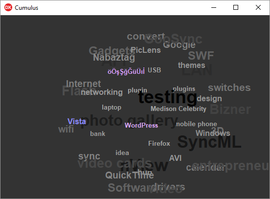

# Cumulus

## About

This is a Delphi port of the infamous "WP-Cumulus" WordPress plugin, originally an ActionScript flash project written by Roy Tanck.

<!---->

## Usage

```delphi
procedure TfrmCumulus.FormShow(Sender: TObject);
var
  MyXML : IXMLDocument;
begin
  TagCloud := TTagCloud.Create(Self);
  TagCloud.Parent := Self;
  TagCloud.OnNavigateToURL := NavigateToURLHandler;

  TagCloud.Align := alClient;

  TagCloud.TagsColor := $ffffff;
  TagCloud.BackgroundColor := $333333;
  TagCloud.TransparentMode := False;
  TagCloud.RotationSpeed := 100;
  TagCloud.EvenlyDistributedTags := True;
  TagCloud.DisplayMode := dmTags;

  try
    MyXML := LoadXMLDocument('tagcloud.xml');
    TagCloud.Initialize(MyXML);
  except
    ShowMessage('Failed while attempting to load XML file.');
  end;
end;
```
<!--  -->
## License

Cumulus is licensed under the MIT License - see the [LICENSE-DELPHI](LICENSE-DELPHI.md) file for details.
